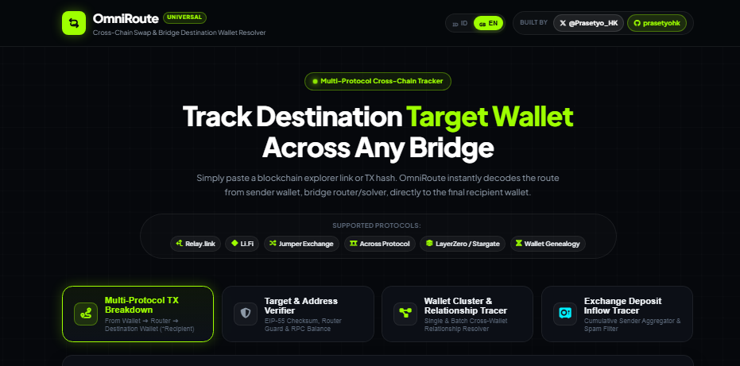
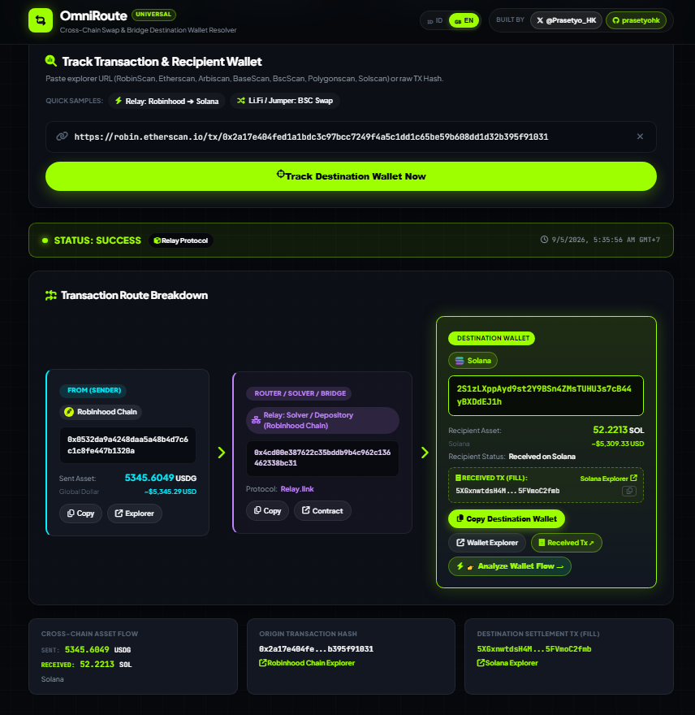
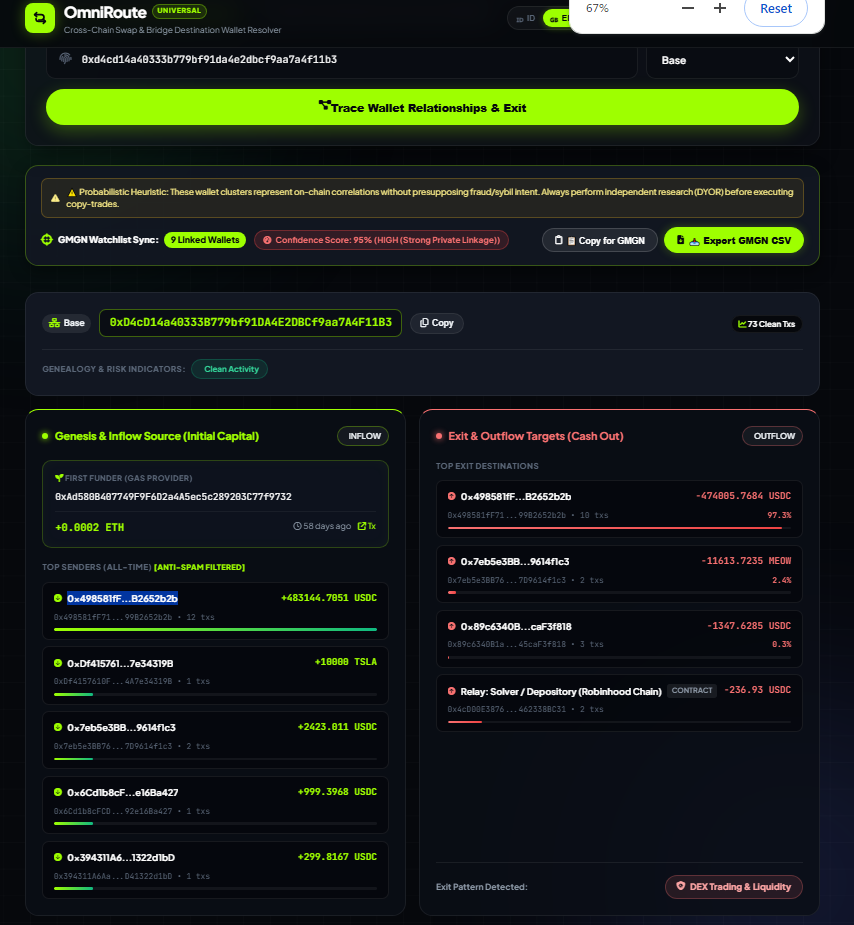
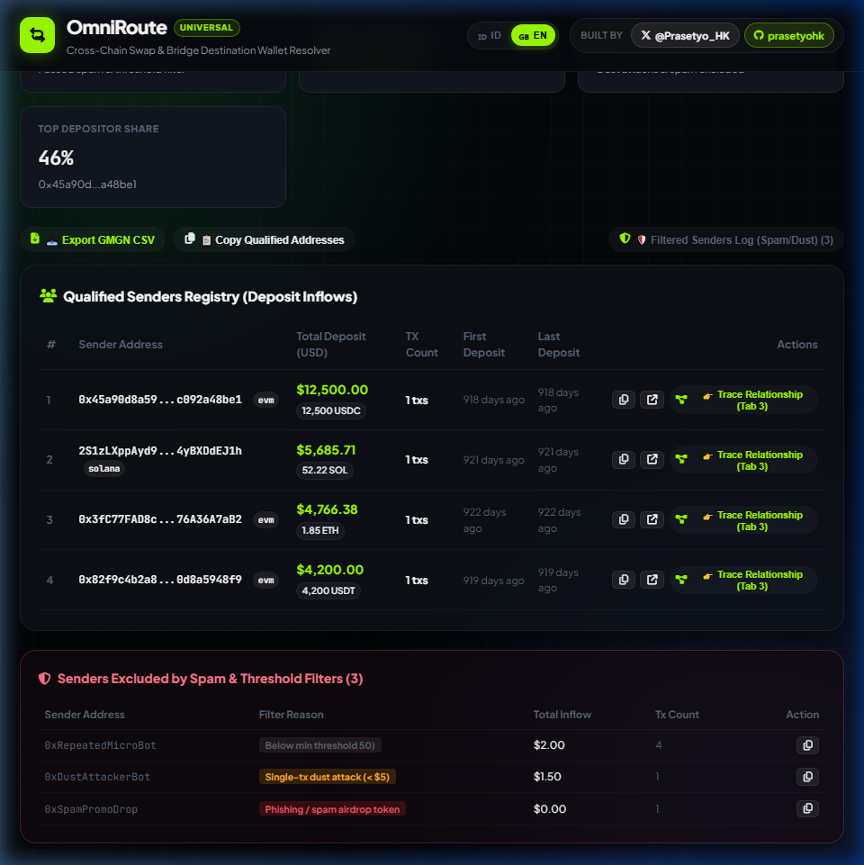

# OmniRoute — Universal Cross-Chain Wallet Intelligence Tool

> **Bahasa Indonesia 🇮🇩 | English 🇬🇧** — Panduan lengkap dan visual alur kerja tersedia dalam dua bahasa di bawah.

**Built with passion by Prasetyo HK**  
[](https://x.com/Prasetyo_HK)
[](https://github.com/prasetyohk)



---

## 🇮🇩 Bahasa Indonesia

### Tentang OmniRoute

**OmniRoute** adalah platform intelijen dan pelacak wallet lintas rantai (*cross-chain*) berbasis Python yang berjalan 100% secara lokal dan privat di komputer Anda. Dirancang khusus untuk membedah transaksi jembatan (*bridge*), memverifikasi keaslian wallet vs smart contract, menelusuri klaster pendanaan (*wallet genealogy*), serta mengaudit aliran deposit exchange dengan filter anti-spam multi-tier.

Antarmuka dirancang dengan standar **FinTech X** (latar hitam obsidian `#06080C` dipadukan dengan aksen *electric lime* `#9EFF00`) yang responsif, modern, dan dilengkapi dukungan dwibahasa (ID/EN).

---

### 🔄 Diagram Alur Kerja Sistem (Workflow Architecture)

```
┌─────────────────────────────────────────────────────────────────────────────────┐
│                           OmniRoute Intelligence Core                           │
└─────────────────────────────────────┬───────────────────────────────────────────┘
                                      │
       ┌──────────────────────────────┼─────────────────────────────┐
       ▼                              ▼                             ▼
┌──────────────┐              ┌──────────────┐              ┌──────────────┐
│    Tab 1     │              │    Tab 3     │              │    Tab 4     │
│Route Resolver│              │Wallet Cluster│              │Deposit Tracer│
└──────┬───────┘              └──────┬───────┘              └──────┬───────┘
       │                             │                             │
       ▼                             ▼                             ▼
[Parse TX Hash/URL]           [Trace Genealogy]             [Auto Multi-Chain]
  - Origin Sender               - Genesis Funder              - Parallel 5 EVM Chains
  - Protocol Solver             - All-Time Senders            - Solana ATA Resolution
  - Destination Target          - Cashout / Exit Hub          - Multi-Tier Spam Filter
  - Fill Settlement TX          - GMGN Watchlist Sync         - DexScreener USD Valuation
```

---

### Fitur Utama & Cara Kerja — 4 Mesin Analisis

---

#### 🔁 Tab 1: Route Resolver (Pelacak Rute Swap & Bridge)

Lacak rute transaksi swap atau bridge dari wallet pengirim ➔ router/solver protokol ➔ dompet penerima di rantai tujuan.



**Cara Kerja & Alur Analisis:**
1. Masukkan tautan block explorer (RobinScan, Etherscan, Arbiscan, Basescan, Bscscan, Polygonscan, Solscan) atau langsung TX hash mentah.
2. Mesin OmniRoute membaca calldata, mendeteksi protokol bridge (**Relay.link**, **Li.Fi / Jumper Exchange**, **Across Protocol**, **LayerZero / Stargate**, atau **Universal EVM Fallback**).
3. Menguraikan 3 simpul utama:
   * **From (Pengirim):** Wallet asal, jaringan pengirim, dan aset yang didepositkan.
   * **Router / Solver / Bridge:** Kontrak pintar atau solver relay yang memfasilitasi pertukaran.
   * **Destination Wallet:** Alamat penerima akhir di chain tujuan, jumlah token yang diterima, serta tautan TX penyelesaian (*fill settlement*).
4. Tombol 1-klik untuk menyalin wallet tujuan, membuka explorer tujuan, serta opsi *"Analyze Wallet Flow"* untuk meneruskan analisis ke Tab 3.

---

#### 🔍 Tab 2: Target & Address Verifier (Verifikasi Alamat & Target)

Verifikasi apakah suatu alamat merupakan **dompet pribadi (EOA)** atau **smart contract** sebelum melakukan transaksi atau penyalinan alamat.

**Cara Kerja & Fitur:**
* **EIP-55 Checksum Guard:** Menghasilkan format huruf besar/kecil resmi untuk mencegah salah kirim dana.
* **On-Chain Bytecode Inspector:** Memeriksa RPC langsung ke blockchain untuk memastikan apakah target memiliki bytecode kontrak atau merupakan EOA murni.
* **Known Protocol Registry:** Otomatis menandai jika alamat tersebut adalah router publik (Uniswap, 1inch, Across, Relay, dll.) atau hot wallet bursa terpusat.
* **Live Native Balance:** Menampilkan saldo asli (ETH, SOL, BNB, POL) langsung dari node RPC publik.

---

#### 🕸️ Tab 3: Wallet Cluster & Relationship Tracer (Pelacak Silsilah & Relasi Dompet)

Lacak asal modal pertama (*genesis funder*), relasi antar-dompet, dan muara pencairan dana (*cashout exit*) secara menyeluruh.



**Cara Kerja & Fitur:**
* **Genesis Funder (Gas Provider Pertama):** Mengidentifikasi wallet root yang pertama kali mendanai gas native ke wallet target.
* **Top Senders (All-Time Inflow):** Mengagregasi penyumbang dana terbesar dengan tombol salin alamat per-baris.
* **Exit & Outflow Targets (Cash Out):** Menampilkan ke mana saja dana dialirkan, lengkap dengan persentase dominasi dan deteksi pola (CEX, DEX Liquidity, Bridge, Mixer).
* **Batch Relationship Analysis (2–20 Wallets):** Membandingkan beberapa wallet sekaligus untuk mendeteksi apakah memiliki kesamaan *genesis funder* atau *consolidation hub*.
* **Confidence Score (0–100%):** Skor probabilitas relasi pribadi yang aman dari *false positive* (CEX hot wallet & faucet publik dikecualikan secara otomatis).
* **GMGN Watchlist Export:** Export seluruh wallet terkait ke format CSV atau copy langsung untuk dimasukkan ke GMGN.

---

#### 📥 Tab 4: Exchange Deposit Inflow Tracer (Pelacak Aliran Masuk Deposit)

Berikan satu alamat deposit bursa (misal deposit Binance, Bybit, OKX, atau personal vault), OmniRoute akan membedah seluruh pengirim dana dan total volume kumulatifnya.



**Cara Kerja & Alur Pemindaian:**
1. **Multi-Chain EVM Auto-Scan:**
   * Saat memilih mode `auto` pada alamat EVM, OmniRoute **memindai 5 chain EVM sekaligus secara paralel** (Ethereum, Arbitrum One, Base, Polygon, Optimism) menggunakan `ThreadPoolExecutor`.
   * Mendukung Solana dengan resolusi ATA (*Associated Token Account*) ke *owner* wallet asli.
2. **Multi-Tier Anti-Spam & Dust Engine:**
   * **Cumulative Min Threshold:** Menyaring berdasarkan akumulasi total deposit pengirim (bukan per transaksi).
   * **Single-Tx Dust Attack Filter:** Membuang transaksi spam microrate (< $5).
   * **Phishing Token Blacklist:** Mengeliminasi airdrop scam dengan regex pola URL / homoglyph token palsu.
3. **Filtered Senders Drawer:**
   * Transparansi penuh: semua transaksi yang disaring disimpan dalam *drawer* khusus dengan alasan jelas (*below min threshold*, *single-tx dust*, atau *phishing token*).
4. **Export & Deep Trace:**
   * Setiap baris pengirim yang lolos kualifikasi dilengkapi tombol salin, tautan explorer spesifik chain, serta tombol pintas *"Trace in Tab 3"*.

---

### Cara Menjalankan

#### Cara 1: Double-Click Launcher (Windows)
1. Buka folder proyek.
2. Klik ganda **`start_omniroute.bat`**.
3. Browser akan otomatis terbuka ke `http://127.0.0.1:5000`.

#### Cara 2: Terminal / Command Prompt
```bash
pip install -r requirements.txt
python app.py
```
Akses di browser: `http://127.0.0.1:5000`

---

---

## 🇬🇧 English

### About OmniRoute

**OmniRoute** is a locally-hosted, privacy-first cross-chain wallet intelligence platform built with Python. It is engineered to decode complex cross-chain bridge swaps, verify wallet vs contract authenticity, map funder genealogy, and inspect centralized exchange deposit inflows with multi-tier spam filtering.

Crafted with a sleek **FinTech X** UI (obsidian black `#06080C` with vibrant electric lime `#9EFF00`), OmniRoute offers zero-latency local execution and seamless bilingual support (Indonesian & English).

---

### 🔄 System Architecture & Workflow

```
┌─────────────────────────────────────────────────────────────────────────────────┐
│                           OmniRoute Intelligence Core                           │
└─────────────────────────────────────┬───────────────────────────────────────────┘
                                      │
       ┌──────────────────────────────┼─────────────────────────────┐
       ▼                              ▼                             ▼
┌──────────────┐              ┌──────────────┐              ┌──────────────┐
│    Tab 1     │              │    Tab 3     │              │    Tab 4     │
│Route Resolver│              │Wallet Cluster│              │Deposit Tracer│
└──────┬───────┘              └──────┬───────┘              └──────┬───────┘
       │                             │                             │
       ▼                             ▼                             ▼
[Parse TX Hash/URL]           [Trace Genealogy]             [Auto Multi-Chain]
  - Origin Sender               - Genesis Funder              - Parallel 5 EVM Chains
  - Protocol Solver             - All-Time Senders            - Solana ATA Resolution
  - Destination Target          - Cashout / Exit Hub          - Multi-Tier Spam Filter
  - Fill Settlement TX          - GMGN Watchlist Sync         - DexScreener USD Valuation
```

---

### Key Features & Mechanics — 4 Analytics Engines

---

#### 🔁 Tab 1: Route Resolver

Decodes complex cross-chain bridges and swaps, revealing the exact path from source sender ➔ solver/router contract ➔ final destination wallet on the target chain.


**Workflow & Core Capabilities:**
1. Paste any explorer URL (RobinScan, Etherscan, Arbiscan, Basescan, Bscscan, Polygonscan, Solscan) or raw transaction hash.
2. Protocol-aware decoding supports **Relay.link**, **Li.Fi / Jumper Exchange**, **Across Protocol**, **LayerZero / Stargate**, and generic **Universal EVM Fallback**.
3. 3-node visual breakdown:
   * **From (Sender):** Origin address, source blockchain, and deposited asset valuation.
   * **Router / Solver / Bridge:** Intermediary smart contract or relay solver handling the cross-chain execution.
   * **Destination Wallet:** Final recipient wallet on the target network, received token amount, USD equivalent, and the fill settlement transaction link.
4. Instant copy actions for destination wallet, origin TX hash, and settlement TX, plus a direct shortcut to analyze fund flow in Tab 3.

---

#### 🔍 Tab 2: Target & Address Verifier

Validates address integrity and detects whether a target is a **personal wallet (EOA)** or a **smart contract** before sending transactions.

**Workflow & Capabilities:**
* **EIP-55 Checksum Enforcement:** Converts raw hex to official mixed-case checksum format to prevent typos.
* **On-Chain Bytecode Inspector:** Queries live blockchain nodes to determine contract code presence vs pure EOA.
* **Known Entity & Router Guard:** Flags recognized routers, DEX pools, CEX deposit gateways, and bridge contracts.
* **Live Native Balance:** Fetches real-time ETH, SOL, BNB, or POL balance directly from RPC.

---

#### 🕸️ Tab 3: Wallet Cluster & Relationship Tracer

Maps capital genealogy, detects shared funding origins, and identifies cashout destinations across all historical activity.


**Workflow & Capabilities:**
* **Genesis Funder (Root Wallet):** Pinpoints the earliest transaction that funded native gas into the target address.
* **Top Senders (All-Time Inflows):** Aggregates major depositors with individual copy controls.
* **Exit & Outflow Destinations:** Analyzes cashout behaviors with automatic category classification (CEX, DEX Liquidity, Bridge, Mixer).
* **Batch Cluster Analysis (2–20 Wallets):** Tests multiple wallets for common private genesis funders or consolidation hubs.
* **False-Positive Resistant Confidence Scoring (0–100%):** Excludes noisy public entities (CEX hot wallets, faucets) to prevent erroneous clustering.
* **GMGN Watchlist Export:** One-click CSV download or clipboard copy formatted for direct import into GMGN.

---

#### 📥 Tab 4: Exchange Deposit Inflow Tracer

Given an exchange deposit address, OmniRoute scans and aggregates all incoming funding wallets and their cumulative volume.


**Workflow & Scanning Pipeline:**
1. **Parallel Multi-Chain EVM Scanning:**
   * When `auto` chain is selected for EVM addresses, OmniRoute **queries 5 major chains simultaneously** (Ethereum, Arbitrum One, Base, Polygon, Optimism) via `ThreadPoolExecutor`.
   * Full Solana support with automated Associated Token Account (ATA) to wallet owner resolution.
2. **Multi-Tier Anti-Spam & Phishing Filter:**
   * **Cumulative USD Filter:** Evaluates total deposit volume per sender rather than individual transactions.
   * **Dust Attack Filter:** Removes single micro-transactions (< $5).
   * **Phishing Token Guard:** Regex blacklist filters out spam airdrops and deceptive zero-value tokens.
3. **Transparent Filtered Log Drawer:**
   * Inspect all excluded wallets and review exact filter reasons (*below threshold*, *dust attack*, or *phishing token*).
4. **Actionable Registry:**
   * Displays qualified senders sorted by deposit volume with chain badges, explorer links, and direct *"Trace in Tab 3"* shortcuts.

---

### How to Run

#### Option 1: Double-Click Launcher (Windows)
1. Open the project folder.
2. Double-click **`start_omniroute.bat`**.
3. Your default browser will automatically open `http://127.0.0.1:5000`.

#### Option 2: Command Line
```bash
pip install -r requirements.txt
python app.py
```
Open `http://127.0.0.1:5000` in your browser.

---

### Tech Stack

- **Backend**: Python 3.10+ / Flask
- **Concurrency**: `concurrent.futures.ThreadPoolExecutor` for high-speed multi-chain querying
- **Pricing Engine**: DexScreener API (highest-liquidity pair selection) + CoinGecko
- **Frontend**: Vanilla HTML5 + CSS3 (Glassmorphism / FinTech X Design System) + Modern JavaScript
- **Typography**: Google Fonts (Plus Jakarta Sans & JetBrains Mono)
- **Icons**: Font Awesome 6 Pro Free CDN
- **Chains Supported**: Ethereum, Base, Arbitrum One, BNB Chain, Polygon, Optimism, Solana

---

### ⚠️ Disclaimer

> **EN**: OmniRoute is an on-chain data correlation tool. All relationship and cluster outputs are probabilistic heuristics. Wallets may share transaction histories for legitimate reasons. Always conduct independent research (DYOR).  
> **ID**: OmniRoute adalah alat korelasi data on-chain. Semua hasil analisis klaster dan relasi bersifat heuristik probabilistik. Selalu lakukan riset mandiri (DYOR) sebelum mengambil keputusan.

---

## Author / Pembuat

| | |
|---|---|
| **Developer** | Prasetyo HK |
| **X (Twitter)** | [@Prasetyo_HK](https://x.com/Prasetyo_HK) |
| **GitHub** | [prasetyohk](https://github.com/prasetyohk) |

---

## ☕ Support & Donations / Dukung Proyek Ini

> **EN**: If OmniRoute streamlined your on-chain research and workflow, contributions are always appreciated!  
> **ID**: Jika OmniRoute membantu riset on-chain dan alur kerja Anda, dukungan Anda sangat berarti!

| Network | Address |
|---------|---------|
| **EVM** (Ethereum / Base / Arbitrum / BSC / Polygon) | `0xFCDD187D32cFaecD8B07638BD6004fA2bF6838C6` |
| **Solana** | `2zyBHgVYNp5WnKUK25WsdsQbsMzkj8Kzw2wDePWAnGZYS` |
| **Sui** | `0xfac84087048bf82f4f99c7704ee0cf9b1386c064b8ea845ab6baf65d1153eb09` |
| **Bitcoin** | `bc1qulgaaddxhl9qz5jcs4wu5tx5j3g9ng3lfd4cl0` |

*Terima kasih / Thank you!* 🙏

---

*OmniRoute — Universal Cross-Chain Wallet Intelligence. Built locally, runs privately.*
